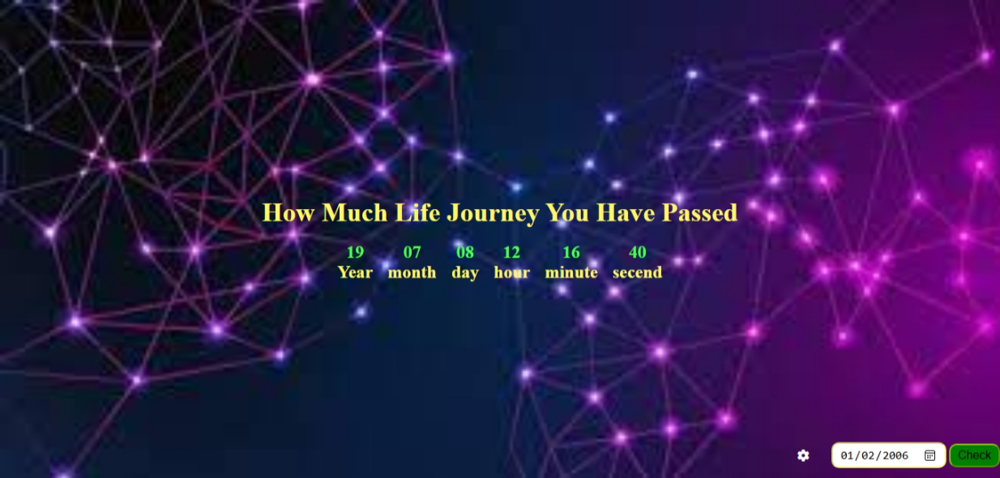

# Age Checker – Life Journey Timer

This project calculates how much of your life journey you have passed in years, months, days, hours, minutes, and seconds based on your date of birth. It is a simple and interactive web application built using HTML, CSS, and JavaScript.

## Features

- User can input their date of birth using a date picker.
- Real-time update every second showing:
  - Years
  - Months
  - Days
  - Hours
  - Minutes
  - Seconds
- Toggle button (gear icon) to show or hide the input section.
- Responsive and visually appealing user interface.
- Smooth animations on number cards.

## Folder Structure
```
project_1  (Checking Age)/
│
├── index.html # Main HTML structure
├── style.css # Styling file
├── app.js # JavaScript logic for age calculation
├── 2.jpeg # Background image used in the project
├── image.png # project screenshot
└── README.md # Project documentation
```

## Technologies Used

- HTML5
- CSS3
- JavaScript (Vanilla)
- Font Awesome (for icons)

## How It Works

1. The user clicks the gear icon to toggle the date input section.
2. Upon entering a birth date and clicking the "Check" button, the UI updates.
3. The time since birth is displayed in real-time using JavaScript's `Date` object.
4. The values continue updating every second to reflect the user's life journey.

## Preview



## Author

**Sohaib Kundi**  
Frontend & MERN Stack Developer  
- [GitHub](https://github.com/sohaibkundi2)
-  [LinkedIn](https://www.linkedin.com/in/sohaibkundi2)
