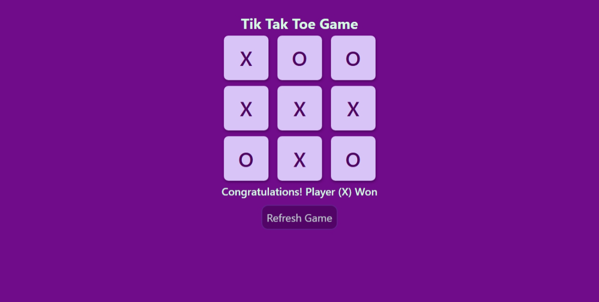

## Tic Tac Toe

### Summary  
A classic 2-player Tic Tac Toe game built using HTML, CSS, and JavaScript, allowing players to take turns and play on a 3x3 grid.

### Features  
- 3x3 grid-based game interface  
- Interactive box clicks for each player's move  
- Displays the winner once a player wins  
- "Refresh Game" button to restart the game  
- Visual styles and feedback using CSS  

### Tech Stack  
- HTML  
- CSS  
- JavaScript

### Preview  

### Author  
**Sohaib Kundi**  
Frontend & MERN Stack Developer  
[GitHub](https://github.com/sohaibkundi)  
[LinkedIn](https://www.linkedin.com/in/sohaibkundi2)
