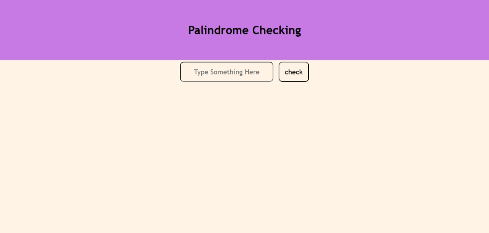

## Palindrome Checker

### Summary  
This mini tool checks whether a given string is a palindrome (reads the same forward and backward). It provides instant feedback using alert messages.

### Features  
- Input field to enter text  
- Button to trigger palindrome check  
- Reverses the string and compares it  
- Alerts the user whether the input is a palindrome

### Tech Stack  
- HTML  
- CSS (inline styles for layout)  
- JavaScript (string manipulation and comparison)

### Preview  

### Author  
**Sohaib Kundi**  
Frontend & MERN Stack Developer  
[GitHub](https://github.com/sohaibkundi2)  
[LinkedIn](https://www.linkedin.com/in/sohaibkundi2)
