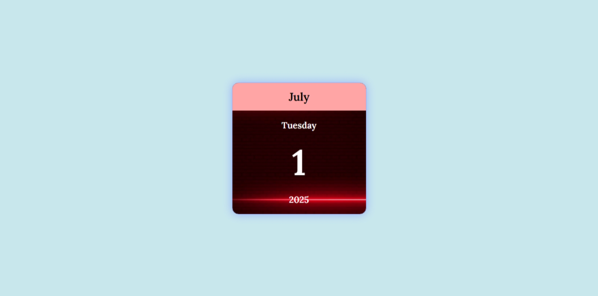

## project_13 (Calendar)

### Summary  
A simple and visually styled calendar project that displays the current Gregorian date including day, month, and year.

### Features  
- Displays current day of the week  
- Shows full month name  
- Highlights the current date and year  
- Responsive layout with hover effects  
- Stylish background and custom font

### Tech Stack  
- HTML  
- CSS  
- JavaScript (Date object)

### Preview  

### Author  
**Sohaib Kundi**  
Frontend & MERN Stack Developer  
[GitHub Profile](https://github.com/sohaibkundi2)  
[LinkedIn Profile](https://www.linkedin.com/in/sohaibkundi2)
