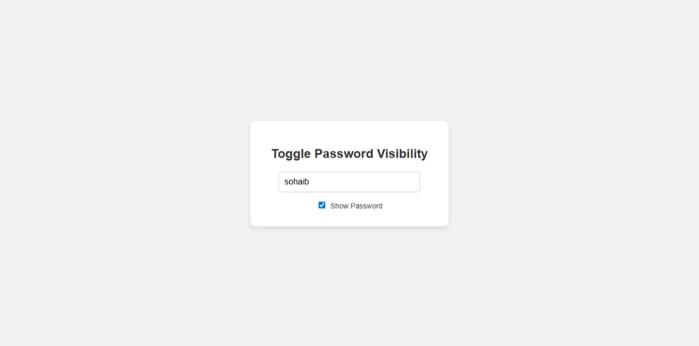

# Password Visibility Toggle

A simple web-based tool that allows users to toggle the visibility of their password input field using a checkbox.

## Features

- Toggle between hidden and visible password
- User-friendly interface
- Styled using inline CSS for quick integration

## Tech Stack

- HTML
- JavaScript (Vanilla)
- Inline CSS

## Preview

## How It Works

- User types password into the input field.
- When the checkbox is checked, the password is revealed.
- When unchecked, the password is hidden again.

## Author

[Sohaib Kundi](https://github.com/Sohaibkundi2)
