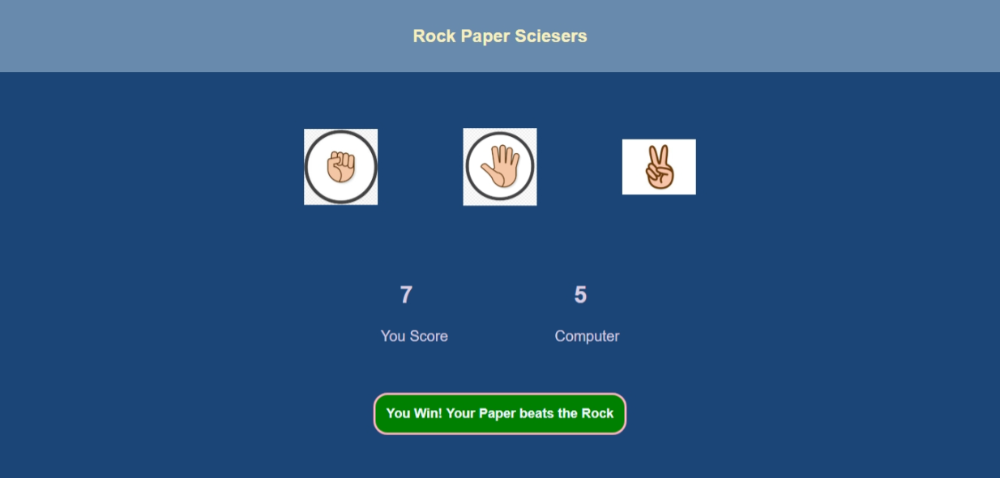

# Rock Paper Scissors Game

A fun and interactive Rock Paper Scissors game built using HTML, CSS, and JavaScript. It allows the user to play against the computer with score tracking and visual feedback.

## Features

- Click-based selection: Rock, Paper, or Scissors
- Computer generates a random move
- Score tracking for both player and computer
- Visual result message after each round (Win, Lose, Draw)
- Basic responsive design and hover effects

## Tech Stack

- HTML
- CSS
- JavaScript (Vanilla)

## Preview

## How to Play

- Click on **Rock**, **Paper**, or **Scissors**
- The computer randomly chooses its move
- Results are shown immediately with updated scores
- Click again to play the next round

## Author

[Sohaib Kundi](https://github.com/Sohaibkundi2)
