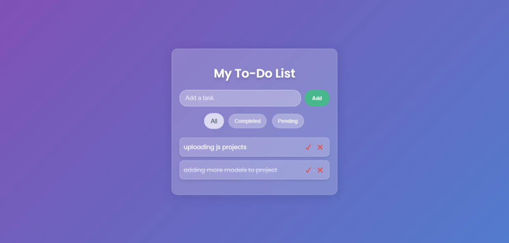

# To-Do List Application

This is a classic and essential to-do list application that allows users to add, track, and manage their tasks. It features filtering options to view all, completed, or pending tasks.

## Features

- **Add Tasks:** Easily add new tasks to the list.
- **Mark as Complete:** Click on a task to toggle its completion status.
- **Filter Tasks:** View all tasks, or filter by "Completed" or "Pending."
- **Clean UI:** A simple and intuitive interface for managing tasks.
- **Font Awesome Icons:** Uses Font Awesome for icons, enhancing the visual appeal.

## Folder Structure
```
project_18 (to-do list)/
│
├── index.html # Main HTML structure
├── style.css # Styling file
├── script.js # JavaScript logic for the to-do list functionality
└── README.md # Project documentation
```

## Technologies Used

- HTML5
- CSS3
- JavaScript (Vanilla)
- Font Awesome

## preview


## Author

**Sohaib Kundi**  
Frontend & MERN Stack Developer  
- [GitHub](https://github.com/sohaibkundi2)
-  [LinkedIn](https://www.linkedin.com/in/sohaibkundi2)