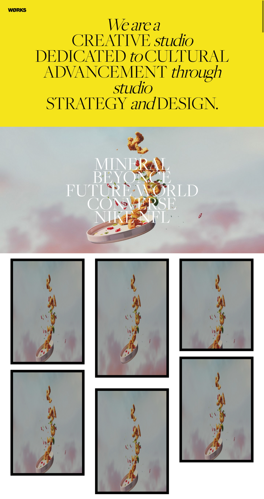

# Interactive Portfolio Showcase

This project is a visually engaging portfolio showcase with a focus on smooth animations and interactive elements. It uses Locomotive Scroll for smooth scrolling and GSAP for a variety of animations, creating a dynamic and modern user experience.

## Features

- **Loading Animation:** A creative loading animation with a video background.
- **Smooth Scrolling:** Implements Locomotive Scroll for a fluid scrolling experience.
- **Interactive Elements:** Features moving text and image elements that respond to user interaction.
- **Hover Effects:** Images and other elements have hover effects that reveal more information or change their appearance.
- **Project Showcase:** A dedicated section to display various projects with images and titles.

## Folder Structure
```
project_19 (works)/
│
├── index.html # Main HTML structure
├── style.css # Styling file
├── script.js # JavaScript logic for animations and interactivity
├── assets/ # Folder with images and videos
└── README.md # Project documentation
```

## Technologies Used

- HTML5
- CSS3
- JavaScript (Vanilla)
- Locomotive Scroll
- GSAP (GreenSock Animation Platform)

## preview



## Author

**Sohaib Kundi**  
Frontend & MERN Stack Developer  
- [GitHub](https://github.com/sohaibkundi2)
-  [LinkedIn](https://www.linkedin.com/in/sohaibkundi2)