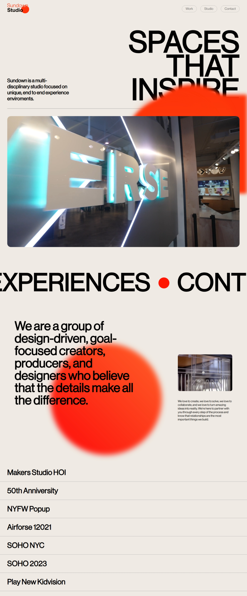

# Sundown Studio Clone

This project is a clone of the Sundown Studio website, a multi-disciplinary studio. It's a visually rich and interactive website with a focus on animations and a clean, modern design.

## Features

- **Loading Animation:** A creative loading animation with text elements.
- **Smooth Scrolling:** Implements Locomotive Scroll for a fluid scrolling experience.
- **Interactive Elements:** Features moving text, image carousels, and hover effects.
- **Video Background:** A video background on the hero section.
- **SwiperJS Carousel:** A testimonial carousel powered by SwiperJS.
- **Responsive Design:** The website is designed to be responsive and work on different screen sizes.

## Folder Structure
```
project_20 (Sundown Studio)/
│
├── index.html # Main HTML structure
├── style.css # Styling file
├── script.js # JavaScript logic for animations and interactivity
├── assets/ # Folder with images, videos, and fonts
└── README.md # Project documentation
```

## Technologies Used

- HTML5
- CSS3
- JavaScript (Vanilla)
- Locomotive Scroll
- SwiperJS
- GSAP (GreenSock Animation Platform)

## preview



## Author

**Sohaib Kundi**  
Frontend & MERN Stack Developer  
- [GitHub](https://github.com/sohaibkundi)
-  [LinkedIn](https://www.linkedin.com/in/sohaibkundi2)