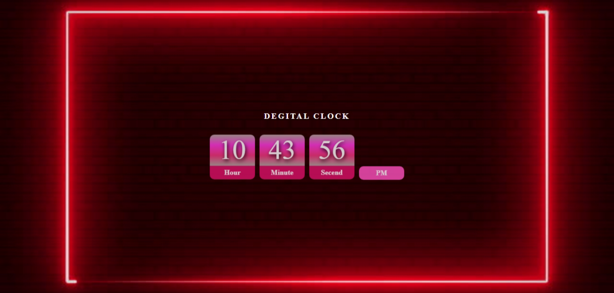

# Digital Clock

A responsive digital clock built with HTML, CSS, and JavaScript that displays the current time in hours, minutes, and seconds format, along with AM/PM notation.

## Features

- Real-time updating digital clock
- Converts 24-hour time to 12-hour format with AM/PM
- Responsive design using Flexbox
- Background image with centered layout

## Tech Stack

- HTML
- CSS
- JavaScript (DOM manipulation, `setInterval`, `Date` object)

## Preview

## Author

**Sohaib Kundi**  
Frontend & MERN Stack Developer  
- [GitHub](https://github.com/sohaibkundi2)
-  [LinkedIn](https://www.linkedin.com/in/sohaibkundi2)
