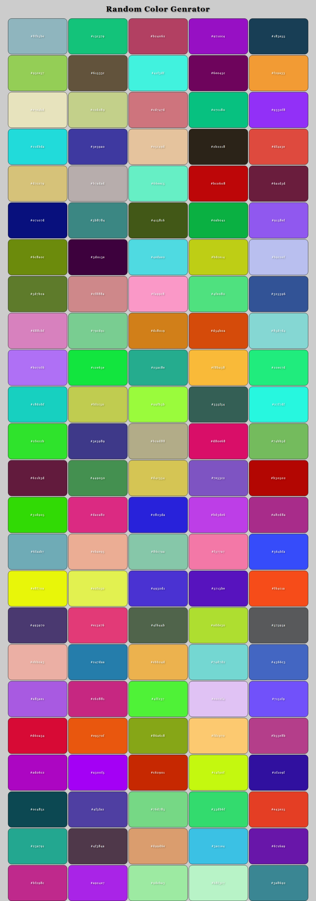

# Random Color Palette Generator

This is a simple color palette generator built using HTML, CSS, and JavaScript. It dynamically creates a grid of color boxes, each with a randomly generated HEX color code.

## Features

- Generates 120 random color tiles
- Each tile displays its respective HEX code
- Easy to extend for copy-to-clipboard or regeneration buttons
- Responsive with basic hover effects

## Tech Stack

- HTML
- CSS
- JavaScript (DOM manipulation, dynamic creation, string generation)

## Preview

## Author

**Sohaib Kundi**  
Frontend & MERN Stack Developer  
- [GitHub](https://github.com/sohaibkundi2)
-  [LinkedIn](https://www.linkedin.com/in/sohaibkundi2)