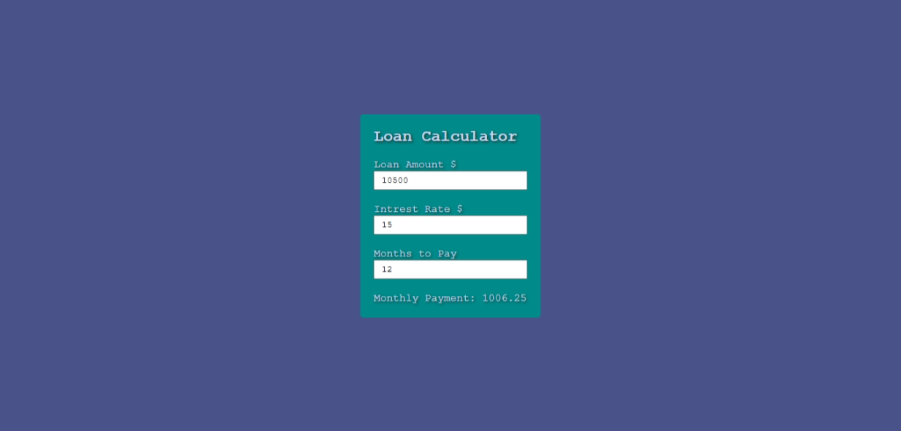

# Loan Calculator

A simple and interactive Loan Calculator built with HTML, CSS, and JavaScript. It dynamically calculates the monthly payment based on the loan amount, interest rate, and repayment period.

## Features

- Calculates monthly loan payments
- Takes loan amount, interest rate, and duration in months as inputs
- Real-time updates using `onchange` events
- Clean and responsive UI

## Tech Stack

- HTML
- CSS
- JavaScript

## Formula Used
```
Monthly Payment = (Loan Amount / Months) + Interest
Interest = (Loan Amount × (Interest Rate / 100)) / Months
```


## Preview



## Author

**Sohaib Kundi**  
Frontend & MERN Stack Developer  
- [GitHub](https://github.com/sohaibkundi)  
- [LinkedIn](https://www.linkedin.com/in/sohaibkundi2)