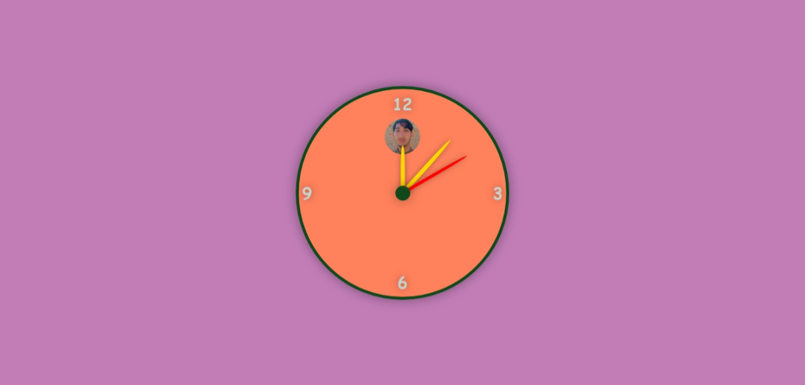

## Analog Clock

### Summary  
A real-time analog clock built using HTML, CSS, and JavaScript. It displays hour, minute, and second hands with smooth rotation updates every second.

### Features  
- Real-time analog clock interface  
- Smooth animated rotation for hour, minute, and second hands  
- Responsive circular design with numbered positions  
- Decorative central image

### Tech Stack  
- HTML  
- CSS  
- JavaScript

### Preview  

### Author  
**Sohaib Kundi**  
Frontend & MERN Stack Developer  
[GitHub](https://github.com/sohaibkundi)  
[LinkedIn](https://www.linkedin.com/in/sohaibkundi2)
