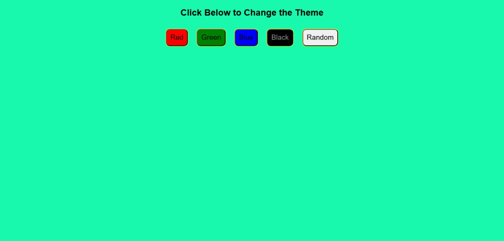

## Theme Changer

### Summary  
A simple theme changer website that allows users to switch background colors using preset buttons or generate a random color dynamically.

### Features  
- Switch background to red, green, blue, or black  
- Generate and apply a random background color  
- Minimal and clean interface with JavaScript interactivity  

### Tech Stack  
- HTML  
- CSS  
- JavaScript

### Preview  

### Author  
**Sohaib Kundi**  
Frontend & MERN Stack Developer  
[GitHub](https://github.com/sohaibkundi)  
[LinkedIn](https://www.linkedin.com/in/sohaibkundi2)
